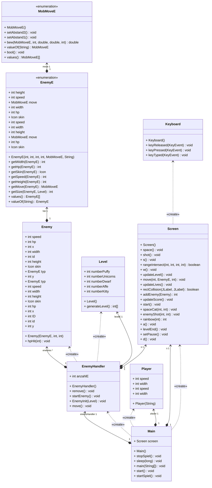

```mermaid
classDiagram
direction BT
class Enemy {
  + Enemy(EnemyE, int, int) 
  + int speed
  + int hp
  + int x
  + int width
  + int id
  + int height
  + Icon skin
  + EnemyE typ
  + int y
  + hpHit(int) void
  + EnemyE typ
  + int speed
  + int width
  + int height
  + Icon skin
  + int hp
  + int x
  + int ID
  + int id
  + int y
}
class EnemyE {
<<enumeration>>
  + EnemyE(int, int, int, int, MobMoveE, String) 
  + int height
  + int speed
  + MobMoveE move
  + int width
  + int hp
  + Icon skin
  + getWidth(EnemyE) int
  + getHp(EnemyE) int
  + getSkin(EnemyE) Icon
  + getSpeed(EnemyE) int
  + getHeight(EnemyE) int
  + getMove(EnemyE) MobMoveE
  + getSize(EnemyE, Level) int
  + values() EnemyE[]
  + valueOf(String) EnemyE
  + int speed
  + int width
  + int height
  + MobMoveE move
  + int hp
  + Icon skin
}
class EnemyHandler {
  + EnemyHandler() 
  + remove() void
  + startEnemy() void
  + EnemyInit(Level) void
  + move() void
  + int anzahlE
}
class Keyboard {
  + Keyboard() 
  + keyReleased(KeyEvent) void
  + keyPressed(KeyEvent) void
  + keyTyped(KeyEvent) void
}
class Level {
  + Level() 
  + generateLevel() int[]
  + int numberPuffy
  + int numberUnicorns
  + int numberDwarf
  + int numberAffe
  + int numberKitty
}
class Main {
  + Main() 
  + stopSpiel() void
  + sleep(long) void
  + main(String[]) void
  + start() void
  + startSpiel() void
  + Screen screen
}
class MobMoveE {
<<enumeration>>
  + MobMoveE() 
  + setAbstand2() void
  + setAbstand1() void
  + bew(MobMoveE, int, double, double, int) double
  + valueOf(String) MobMoveE
  + bool() void
  + values() MobMoveE[]
}
class Player {
  + Player(String) 
  + int speed
  + int width
  + int speed
  + int width
}
class Screen {
  + Screen() 
  + space() void
  + shot() void
  + s() void
  + rangeIntersect(int, int, int, int) boolean
  + w() void
  + updateLevel() void
  + move(int, EnemyE, int) void
  + updateLives() void
  + rectCollision(JLabel, JLabel) boolean
  + addEnemy(Enemy) int
  + updateScore() void
  + start() void
  + spaceCat(int, int) void
  + enemyShot(int, int) void
  + rainbow(int) int
  + a() void
  + levelEnd() void
  + setPause() void
  + d() void
}

Enemy "1" *--> "typ 1" EnemyE 
EnemyE "1" *--> "move 1" MobMoveE 
EnemyHandler "1" *--> "enemies *" Enemy 
EnemyHandler  ..>  Enemy : «create»
EnemyHandler  ..>  Level : «create»
EnemyHandler "1" *--> "levelE 1" Level 
EnemyHandler "1" *--> "s 1" Screen 
Main "1" *--> "enemyHandler 1" EnemyHandler 
Main  ..>  EnemyHandler : «create»
Main  ..>  Player : «create»
Main "1" *--> "player 1" Player 
Main "1" *--> "s 1" Screen 
Main  ..>  Screen : «create»
Screen  ..>  Keyboard : «create»
```
